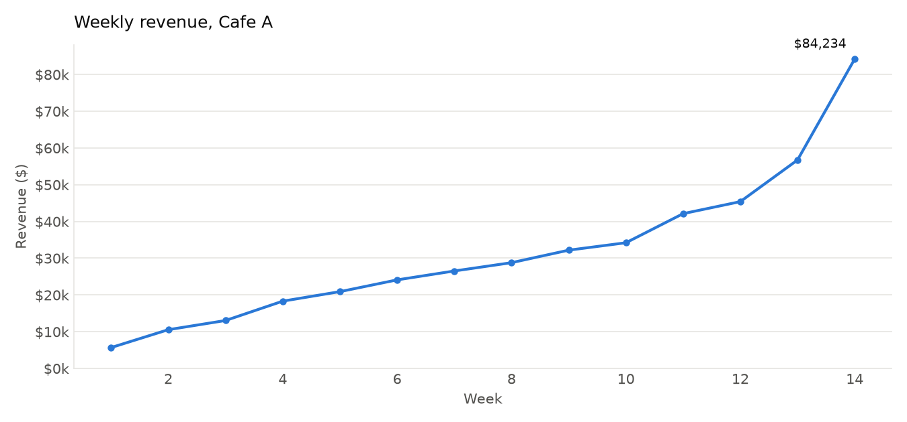
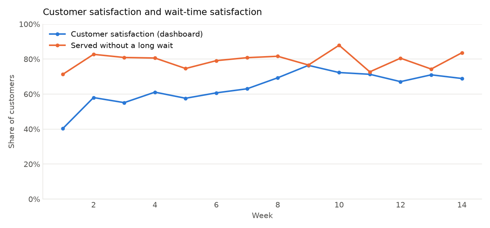
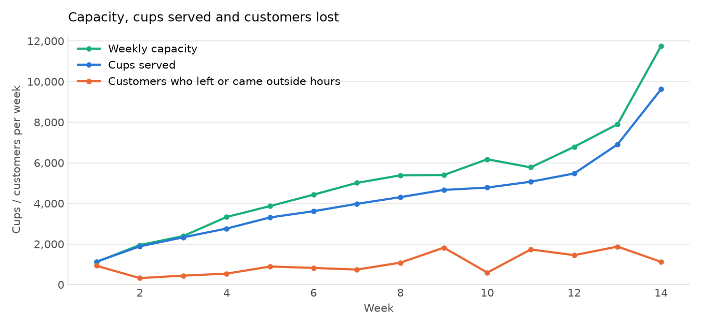

<h1 align="center">Lumo</h1>
<p align="center">
  A Discord data analyst for the messy weekly Excel reports of a business simulation.
</p>

<p align="center">
  
  
  
  
  
  
</p>

Lumo is a Discord bot I built during a course business simulation. Every week the
simulation produced a set of Excel reports for our cafe: a dashboard, a customer survey, a
local labor report, daily receipts, a checkbook and three financial statements. The files
were made for people to read, not for analysis. Lumo pulls the useful numbers into a DuckDB
database, runs the analysis in plain Python, and lets my team ask questions in Discord.

## Why I built this

Fourteen weeks of reports is about a hundred workbooks. The questions we kept asking were
always the same kind:

- How much did revenue increase from week 3 to week 8?
- Which week had the worst wait times?
- What changed in the week before customer satisfaction improved?
- What should we do differently next week?

None of those is hard, but each one meant finding the right file, sheet and cell, doing the
math, and remembering that the income statement is month-to-date while the dashboard is
weekly. I wanted to ask once, in Discord, and get a number I could trust.

## How it works


The part I care most about is that **the language model never does the arithmetic**. Claude
gets the question and a list of Python functions it can call (`compare_metric`,
`week_summary`, `fit_regression`, `evaluate_scenario`, ...). It picks one, Python runs it
against DuckDB, and the result goes back to Claude, which writes the answer. Every number in
an answer comes out of a function, and every function result carries the source file and
cell. If the data is not there, the function says so and Claude passes that on.

The parsers do not rely on fixed cell addresses. Each report is a handful of small tables
under labels ("Measure", "Comments/Suggestions", "Weekly Totals") whose position shifts a
little between weeks, so the parsers find the labels and read relative to them. Values like
`$5,687`, `40.3%`, `3 out of 5`, `$931.25 / week` and `About 50` are cleaned into numbers
with units, and the original text is kept alongside.

## What Lumo can answer

- any metric for any week, with the file and cell it came from
- the change in a metric between two weeks, as an amount, a percent, and percentage points for rates
- a trend over a range of weeks, and the best or worst week
- a summary of one week: dashboard changes, survey ratings, the most-weighted comments, news, labor market, checkbook totals
- keyword search over the survey comments and the news
- financial statement lines and what was actually paid out of the checkbook in a week
- correlations and small regressions between weekly variables
- what-if scenarios and a next-week planning summary

More examples in [examples/example_questions.md](examples/example_questions.md).

### Looking across weeks

Because every report ends up in one database, Lumo can compare weeks instead of treating
each workbook on its own. The charts below are made from the same weekly table the
analysis code uses (`scripts/make_charts.py` regenerates them).

<p align="center">
  
</p>

Revenue grew every week, which is also why a lot of things look correlated in this data.

<p align="center">
  
</p>

Customer satisfaction climbed until week 9 and then slipped while the share of customers
served without a long wait bounced around, which is the kind of pattern that prompted the
"why" questions.

## Example results

A lookup gets a sentence. A "why" question gets evidence.

```text
You:
Why did revenue increase in week 8?

Lumo:
Revenue went from $26,528.49 in week 7 to $28,789.42 in week 8 (+8.5%), and almost all of
it came from volume: cups served rose from 3,979 to 4,310 (+8.3%) while the average price
barely moved ($6.05 to $6.06). Capacity rose with it (5,013 to 5,382 cups, one more
employee), and the industry news for the week mentions an unexpected increase in demand.
At the same time about 1,082 customers left or came outside hours, up from 742, so the
cafe did not keep up with everyone who showed up.
```

Behind that answer are two function calls, `compare_weeks(7, 8)` and `week_summary(8)`.
The figures are read from the Week 7 and Week 8 dashboards and receipts.

## From analysis to planning

Once the historical analysis was working, I added a small planning layer:

- simple regressions and correlations between weekly variables
- a bottleneck check on the latest week (utilization, customers lost, wait times, complaints)
- scenario tests such as "what if we add four employees?" or "what if demand rises 10%?"
- a next-week summary that ranks a few candidate moves on an objective

The scenario model is a few lines of arithmetic: capacity per employee, demand, the share of
customers lost as the cafe gets busier (fitted on the past weeks), revenue per cup, payroll.
Every assumption it uses is listed in the result, and the one thing it cannot learn from the
data, how demand reacts to price, is an explicit assumption you can change. These are
scenario estimates, not forecasts.

<p align="center">
  
</p>

Capacity and cups served grew together, but customers kept walking away even in weeks with
room to spare, because busy days fill up first. That is why the scenario model estimates
lost customers from how busy the cafe is rather than capping sales at capacity.

## Running it locally

```bash
python -m venv .venv && source .venv/bin/activate
pip install -r requirements.txt
python -m src.ingest                                   # builds lumo.duckdb from data/
python -m src.chat --tool compare_metric '{"metric": "revenue", "start_week": 3, "end_week": 8}'
```

The last command calls a function directly and needs no API key. For the conversation,
copy `.env.example` to `.env`, add an Anthropic API key and run `python -m src.chat`. The
Discord bot needs a bot token as well. [SETUP.md](SETUP.md) has the details.

```
data/            anonymized weekly reports (Week 1 to Week 14) and a README describing them
src/
  values.py      cleaning cell values into numbers with units
  parsers.py     one parser per report type, all label-based
  database.py    DuckDB schema and a small wrapper
  ingest.py      finds the Week folders and loads every report (incremental)
  analytics.py   lookups, comparisons, trends, week summaries, comment and news search
  modeling.py    weekly table, trends, correlations, OLS regression, simple forecast
  planning.py    what-if scenarios and the next-week planner
  agent.py       the tool definitions and the Claude tool loop
  chat.py        terminal chat, and a way to call any function directly
  discord_bot.py the Discord front end
scripts/         anonymize_workbooks.py, make_charts.py
tests/           pytest suite (python -m pytest)
```

## Limitations

- Only 14 weekly observations. Every correlation and regression is exploratory, and most
  metrics grew over the simulation, so many things look related just because they all went up.

## 🧑‍💻 Author

**Adham Elkhouly**

- MSBA Student @ Boston University
- Microsoft Power Platform Functional Consultant Associate
