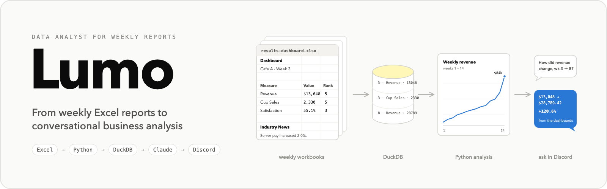

<p align="center">
  
</p>

<p align="center">
  
  
  
  
  
  
  
</p>

Lumo turns the weekly Excel reports of a cafe business simulation into a small analytical
database, answers questions about them with plain Python, and (optionally) lets you ask those
questions in a chat with Claude or in Discord.

**Contents:**
[Why I built it](#why-i-built-it) ·
[What Lumo can do](#what-lumo-can-do) ·
[How it works](#how-it-works) ·
[What the Excel files look like](#what-the-excel-files-look-like) ·
[From Excel to DuckDB](#from-excel-to-duckdb) ·
[Why DuckDB?](#why-duckdb) ·
[Example analysis](#example-analysis) ·
[Running it locally](#running-it-locally) ·
[Three ways to run it](#three-ways-to-run-it) ·
[The optional LLM layer](#the-optional-llm-layer) ·
[Discord](#discord) ·
[Adding another week](#adding-another-week) ·
[Using another dataset](#using-another-dataset) ·
[Limitations](#limitations)

## Why I built it

During a course business simulation, every week ended with a set of Excel reports for our
cafe: a dashboard, a customer survey, a local labor report, daily receipts, a checkbook and
three financial statements. Each file is easy to read on its own. Comparing fourteen weeks
of them, about a hundred workbooks, is not. The questions we kept asking were always the
same kind:

- How much did revenue increase from week 3 to week 8?
- Which week had the worst wait times?
- What changed in the week before customer satisfaction improved?
- What should we do differently next week?

None of those is hard, but each one meant finding the right file, sheet and cell, doing the
math, and remembering that the income statement is month-to-date while the dashboard is
weekly. I wanted to ask once and get a number I could trust.

So Lumo:

- parses those semi-structured Excel reports;
- normalizes the useful values into one consistent shape;
- stores them in a DuckDB database;
- answers lookups, comparisons and trends across weeks;
- runs some simple modeling and what-if scenarios;
- optionally exposes all of that to Claude, so you can ask in plain English;
- optionally uses Discord as the chat interface, so a team can share it.

## What Lumo can do

- any metric for any week, with the file and cell it came from
- the change in a metric between two weeks, as an amount, a percent, and percentage points for rates
- a trend over a range of weeks, and the best or worst week
- a summary of one week: dashboard changes, survey ratings, the most-weighted comments, news, labor market, checkbook totals
- keyword search over the survey comments and the news
- financial statement lines, and what was actually paid out of the checkbook in a week
- correlations and small regressions between weekly variables
- what-if scenarios ("what if we add four employees?") and a next-week planning summary

More examples, with the function behind each one, in
[examples/example_questions.md](examples/example_questions.md).

## How it works


Lumo is not a language model with spreadsheets pasted into the prompt. The language model
is an optional layer at the end, and **Python and DuckDB do all the calculations.**

Here is what happens when you ask *"How much did revenue increase from week 3 to week 8?"*:

```text
Question
   ↓
Claude reads it and decides this is a two-week comparison
   ↓
it calls the Python function compare_metric("revenue", 3, 8)
   ↓
the function queries DuckDB for the Week 3 and Week 8 dashboard values
   ↓
Python computes the change: $13,048.00 → $28,789.42, +$15,741.42 (+120.6%)
   ↓
the result goes back to Claude, which writes the answer in a sentence
```

Claude only chooses which function to call and explains what came back. Every number in an
answer comes out of a function, and every function result carries the source file and cell.
If the data is not there, the function says so and the answer says so. The same functions
can be called from the command line with no language model at all (see
[Three ways to run it](#three-ways-to-run-it)).

## What the Excel files look like

Lumo does not understand arbitrary spreadsheets. It understands one family of reports: the
ones the simulation produced. They are **semi-structured**: made for people to read, not
clean rectangular tables. A workbook has a title block, blank rows, several small tables
with their own header rows, label-and-value pairs, free text, and sometimes several sheets.
This is the Week 3 dashboard, more or less as it appears in Excel:

```text
Dashboard
Cafe A - Week 3

Measure                     Value      Change    Rank
Revenue                     $13,048    23.7%     5
Cup Sales                   2,330      23.7%     5
Customer Satisfaction       55%        -5.1%     3
...

Industry News
Restaurant business was up as students dined out ...
Collegetown hourly server pay increased 2.0%.

Company News
Had to make emergency purchase of 30 pounds of Coffee.
```

And the Week 3 survey, a different layout in the same style:

```text
Customer Survey
Week 3

Company                            Satisfaction   Change
Cafe A                             55.1%          -3.0%
Industry Average (11 Companies)    49.6%          2.0%

Survey Category    Rating
Price              3 out of 5
Service            2 out of 5

Comments/Suggestions    Weight
Long lines.             5
Too expensive!          2
```

### Folder layout

One folder is one week. Lumo reads the week number from the folder name (`Week 1`,
`Week 2`, ...) and recognizes each report by its file name.

```text
data/
├── Week 1/
│   ├── results-dashboard.xlsx
│   ├── results-income_statement.xlsx
│   ├── results-balance_sheet.xlsx
│   ├── results-cash_flow.xlsx
│   ├── results-receipts.xlsx
│   ├── results-checkbook.xlsx
│   ├── market-survey.xlsx
│   └── market-labor.xlsx
├── Week 2/
│   └── ...
├── Week 9/
│   ├── ... (the same eight)
│   └── decisions-review.xlsx      (only this week has one)
...
└── Week 14/
    └── ...
```

| Report | What Lumo extracts |
|---|---|
| `results-dashboard.xlsx` | Revenue, cup sales, satisfaction, capacity utilization, margins, net income, each with its rank among the cafes; industry and company news |
| `market-survey.xlsx` | Our satisfaction vs the industry average, price/ambiance/service ratings, weighted customer comments |
| `market-labor.xlsx` | Local wages, turnover and minimum wage; employees per cafe |
| `results-receipts.xlsx` | Daily capacity, cups served, average price, receipts, long waits, customers lost; weekly product sales (units, price, receipts) |
| `results-checkbook.xlsx` | Every transaction with its account, plus beginning/ending balance and totals per account (advertising, staff, COGS, ...) |
| `results-income_statement.xlsx` | Revenue, costs and profit lines, month to date and year to date |
| `results-balance_sheet.xlsx` | Cash, inventory, assets, liabilities, equity |
| `results-cash_flow.xlsx` | Cash flow statement lines, month to date |
| `decisions-review.xlsx` | The decisions entered for a week: purchases, staffing, pay, prices, marketing (Week 9 only) |

### What the parser tolerates, and what it does not

The parsers look for **labels, not cell addresses**. Each one finds a known header row
("Measure" and "Value", "Comments/Suggestions" and "Weight", "Weekly Totals", ...) and
reads the rows under it until the next blank row. So:

- `Revenue` moving from row 5 to row 9 is fine. The table moved; the labels did not.
- An extra news line, a missing comment, or a product table that is absent one week is fine
  (Weeks 2 and 3 really have no product table, and ingestion just notes it).
- `Revenue` renamed to `Sales` would still be stored (the parser keeps every row of the
  Measure table), but the everyday alias `revenue` would no longer find it until the alias
  list in `src/analytics.py` is updated.
- A report with a new layout, or a workbook from a different system, needs a new or
  modified parser in `src/parsers.py`.

A spreadsheet of loose notes ("Business felt busy today. Maybe we need another employee.")
has nothing for these parsers to anchor on. Lumo can store free text it already knows how
to find (survey comments, news) and search it by keyword, but it does not turn arbitrary
prose into metrics.

The full description of every report, the labels each parser looks for and the database
tables they land in is in [docs/DATA_FORMAT.md](docs/DATA_FORMAT.md).

## From Excel to DuckDB

The reports all have different layouts, so the first job is to turn them into one
consistent shape. Every number becomes one row in a `metrics` table: which week, which
report, which section, what it is called, its value, its unit, and where it came from.

Before, in `Week 3/results-dashboard.xlsx`:

```text
Measure                  Value     Change   Rank
Revenue                  $13,048   23.7%    5
Cup Sales                2,330     23.7%    5
Customer Satisfaction    55%       -5.1%    3
```

After, in the `metrics` table:

```text
week | report_type | section  | metric                | value_numeric | unit    | rank | source_file                   | cell
3    | dashboard   | Measures | Revenue               | 13048.0       | USD     | 5    | Week 3/results-dashboard.xlsx | B5
3    | dashboard   | Measures | Cup Sales             | 2330.0        | count   | 5    | Week 3/results-dashboard.xlsx | B7
3    | dashboard   | Measures | Customer Satisfaction | 0.551         | percent | 3    | Week 3/results-dashboard.xlsx | B9
```

Text values that only look like numbers are cleaned on the way in: `$5,687` becomes
`5687.0` with unit `USD`, `40.3%` becomes `0.403` with unit `percent`, `3 out of 5` becomes
`3.0` on a scale of `5`, `$931.25 / week` keeps its period, and `About 50` keeps the
qualifier "about". The original text is stored next to the number. Things that are not
single numbers get their own tables: survey comments, news lines, checkbook transactions,
daily receipt rows and the decision summary.

Once every week has been normalized, Lumo never reopens a workbook to answer a question. A
question like "how did satisfaction change over the semester" is one query against one
table instead of fourteen file lookups.

### What happens during ingestion

When you run `python -m src.ingest`, Lumo:

1. looks for folders named `Week N` under `data/` (sorted numerically, so Week 10 follows Week 9);
2. finds the `.xlsx` files inside and matches each file name to a report type;
3. reads every worksheet into a grid of non-empty cells;
4. finds the header labels and sections each parser knows about;
5. cleans the values into numbers with units;
6. writes one row per fact into DuckDB, keeping the file, sheet and cell;
7. records each file's SHA-256 hash, so the next run only re-parses files that are new or changed, and removes rows for files that were deleted.

```text
$ python -m src.ingest
Weeks found: 14 (Week 1 to Week 14)
Files parsed: 113, unchanged: 0, failed: 0, unsupported: 0
Metrics stored: 1533, survey comments: 210, transactions: 212
  warning: Week 2/results-receipts.xlsx: receipts: no 'Weekly Totals' product table in this week
  warning: Week 3/results-receipts.xlsx: receipts: no 'Weekly Totals' product table in this week
Database: /path/to/lumo-data-analyst/lumo.duckdb
```

## Why DuckDB?

Lumo's data is small. A few thousand rows fit in SQLite, in a CSV, or in memory, and SQLite
would have worked fine. DuckDB was chosen because of the *kind* of questions Lumo asks, not
because of the size.

SQLite is built for application data: storing users, updating a record, inserting an event,
reading one row at a time. Its storage is row-oriented, which is exactly right when a program
reads or changes whole individual records all day.

Lumo almost never does that. After ingestion the database is read-only, and every question
is an analytical scan: take the revenue column across every week; group transactions by
account; average satisfaction over a range; join the weekly table to itself to compare two
weeks. DuckDB is a column-oriented, analytics-first database that runs this kind of query
natively, in a single local file, with no server, and it speaks ordinary SQL.

| | DuckDB | SQLite |
|---|---|---|
| Main use | Analytics | Application / transaction data |
| Local database file | Yes | Yes |
| SQL | Yes | Yes |
| Database server required | No | No |
| Optimized for analytical scans | Yes | Less specialized |
| Excellent for frequent small updates | Not its focus | Yes |
| Works for Lumo's data size | Yes | Yes |
| Why Lumo uses it | Matches an analytics-first workflow | Would also work |

At Lumo's size the performance difference is not noticeable. The choice was about fit:
DuckDB matches an analysis workload and sits naturally in a Python data workflow. Query
results come back as plain Python dicts, and the modeling code (`src/modeling.py`) builds a
one-row-per-week table from them and hands the columns to NumPy and SciPy for trends,
correlations and regression. The charts below are drawn with Matplotlib from that same
table. (Lumo does not use pandas; the dataset is small enough that it did not need it.)

## Example analysis

The charts are generated from the sanitized data in `data/` by `scripts/make_charts.py`.

<p align="center">
  
</p>

Revenue grew every week, which is also why a lot of things look correlated in this data.

<p align="center">
  
</p>

Customer satisfaction climbed until week 9 and then slipped while the share of customers
served without a long wait bounced around, which is the kind of pattern that prompted the
"why" questions.

<p align="center">
  
</p>

Capacity and cups served grew together, but customers kept walking away even in weeks with
room to spare, because busy days fill up first. That is why the scenario model estimates
lost customers from how busy the cafe is rather than capping sales at capacity.

### A conversational answer

A lookup gets a sentence. A "why" question gets evidence.

```text
You:
Why did revenue increase in week 8?

Lumo:
Revenue went from $26,528.49 in week 7 to $28,789.42 in week 8 (+8.5%), and almost all of
it came from volume: cups served rose from 3,979 to 4,310 (+8.3%) while the average price
barely moved ($6.05 to $6.06). Capacity rose with it (5,013 to 5,382 cups, one more
employee), and the industry news for the week mentions an unexpected increase in demand.
At the same time about 1,082 customers left or came outside hours, up from 742, so the
cafe did not keep up with everyone who showed up.
```

Behind that answer are two function calls, `compare_weeks(7, 8)` and `week_summary(8)`.
The figures are read from the Week 7 and Week 8 dashboards and receipts.

### Planning

Once the historical analysis worked, I added a small planning layer: regressions and
correlations between weekly variables, a bottleneck check on the latest week, scenario tests
such as "what if we add four employees?" or "what if demand rises 10%?", and a next-week
summary that ranks a few candidate moves. The scenario model is a few lines of arithmetic
(capacity per employee, demand, the share of customers lost as the cafe gets busier, revenue
per cup, payroll). Every assumption it uses is listed in its result, and the one thing it
cannot learn from the data, how demand reacts to price, is an explicit assumption you can
change. These are scenario estimates, not forecasts.

## Running it locally

Python 3.11 or newer. Everything below was run as written.

```bash
git clone https://github.com/AdhamKhouly/lumo-data-analyst.git
cd lumo-data-analyst

python3 -m venv .venv
source .venv/bin/activate          # Windows: .venv\Scripts\activate
pip install -r requirements.txt
```

Build the database from the included reports (a few seconds):

```bash
python -m src.ingest
```

Then call the analytics functions directly. No API key, no language model:

```bash
python -m src.chat --tool get_metric '{"metric": "revenue", "week": 7}'
python -m src.chat --tool compare_metric '{"metric": "revenue", "start_week": 3, "end_week": 8}'
python -m src.chat --tool metric_trend '{"metric": "customer satisfaction"}'
python -m src.chat --tool find_extreme_week '{"metric": "lost customers", "mode": "max"}'
python -m src.chat --tool week_summary '{"week": 8}'
python -m src.chat --tool fit_regression '{"target": "revenue", "predictors": ["employees"]}'
python -m src.chat --tool evaluate_scenario '{"changes": {"extra_employees": 4}}'
python -m src.chat --tool plan_next_week '{"objective": "net_income"}'
```

Each prints the JSON the function returns, which is exactly what Claude would see. For
example:

```text
$ python -m src.chat --tool compare_metric '{"metric": "revenue", "start_week": 3, "end_week": 8}'
{
  "status": "ok",
  "metric": "Revenue",
  "unit": "USD",
  "start": { "week": 3, "value": 13048.0, "display": "$13,048.00",
             "source": "Week 3/results-dashboard.xlsx [Dashboard!B5]", ... },
  "end":   { "week": 8, "value": 28789.42, "display": "$28,789.42",
             "source": "Week 8/results-dashboard.xlsx [Dashboard!B5]", ... },
  "absolute_change": 15741.42,
  "absolute_change_display": "$15,741.42",
  "percent_change": 120.64,
  "direction": "increase"
}
```

The full list of functions and their arguments is `TOOLS` in `src/agent.py`. Run the tests
with:

```bash
python -m pytest
```

[SETUP.md](SETUP.md) has the step-by-step setup for the chat and the Discord bot, the
environment variables, and a troubleshooting table.

## Three ways to run it

**Level 1: analytics only.** `Excel → Python → DuckDB → command line`. Ingestion, lookups,
comparisons, trends, week summaries, regressions and scenarios, all through
`python -m src.chat --tool ...`. Needs nothing but Python. This is the whole analytical
system; the other two levels only add a way to talk to it.

**Level 2: conversational mode.** `Excel → Python → DuckDB → analytics → Claude`. Ask in
plain English in the terminal (`python -m src.chat`). Needs an Anthropic API key.

**Level 3: Discord.** `Discord → Claude → Lumo analytics → DuckDB`. The same conversation,
but in a Discord server or DM, with a separate conversation per user
(`python -m src.discord_bot`). Needs the API key and a Discord bot token.

All three are in this repository and work today.

## The optional LLM layer

### What the model actually does

```text
User: "Why did revenue increase in week 8?"
        ↓
Claude decides what it needs to know
        ↓
calls compare_weeks(7, 8) and week_summary(8)
        ↓
Python and DuckDB return the exact values, with their source cells
        ↓
Claude explains the evidence in a few sentences
```

The model is told, in its system prompt, that every number it states must come from a
function result, that it may not calculate or estimate on its own, and that regression
results are associations in about a dozen weeks of data. It can call up to ten functions
per question. The source of numerical truth is the database, not the model.

### Which models work

**Currently supported:** Claude, through the official Anthropic Python SDK. The model is set
with `CLAUDE_MODEL` in `.env` (default `claude-opus-5-5`). The test suite exercises the tool
loop with a fake client, so no test needs an API key.

**Possible to add, not included:** the analytics layer is model-independent. `src/agent.py`
contains the function definitions (`TOOLS`, as JSON schemas), a dispatcher (`run_tool`) and
the loop that sends tool results back to the model (`Lumo.ask`). Another provider that
supports function calling, such as an OpenAI-compatible API, Gemini, or a local model served
through Ollama, could be used by writing an adapter that translates those tool definitions
and runs the same loop. There is no such adapter in this repository yet, so "works with any
LLM" would be an overstatement; "the analytics do not care which LLM you use" is accurate.

### Setting up conversational mode

```bash
cp .env.example .env         # then put your Anthropic API key in it
python -m src.chat
python -m src.chat --ask "How did revenue change from week 3 to week 8?"
python -m src.chat --show-tools      # also prints which functions were called
```

`.env.example` lists every setting, with placeholders:

```text
ANTHROPIC_API_KEY=your_api_key_here
# CLAUDE_MODEL=claude-opus-5-5
DISCORD_BOT_TOKEN=your_bot_token_here
# DISCORD_CHANNEL_IDS=
# DISCORD_ALLOWED_USER_IDS=
```

## Discord

Create a bot application in the Discord Developer Portal, enable the Message Content intent,
put the token in `.env`, invite the bot to your server, then:

```bash
python -m src.discord_bot
```

@mention the bot in a server, or DM it. Each user gets a separate conversation per channel,
so follow-up questions ("what about week 8?") work. `/clear` forgets your conversation and
`/weeks` shows what data is loaded. The exact portal steps are in
[SETUP.md](SETUP.md#5-discord-bot).

**Running vs deploying.** `python -m src.discord_bot` keeps the bot online only while that
terminal process is running. If you want it to stay up, something has to start it for you
and restart it after a reboot: a LaunchAgent on macOS, a `systemd` service on Linux, or Task
Scheduler on Windows. This repository does not ship those files; a short description of
each is in [SETUP.md](SETUP.md#8-keeping-the-bot-running).

## Adding another week

Drop a new `Week 15` folder with the same report files into `data/` and run
`python -m src.ingest` again. The folder is discovered by its name, only the new files are
parsed, and every function picks up the new week immediately. If a report's title says a
different week than the folder name, ingestion prints a warning but still loads it.

## Using another dataset

```text
new Excel format
      ↓
write or modify a parser (src/parsers.py)
      ↓
emit rows in Lumo's existing tables
      ↓
everything downstream stays mostly the same
```

The dataset-specific part is the parser. Everything after it works on the normalized tables:
the DuckDB storage, the lookups and comparisons, trend analysis, the modeling, the Claude
layer and the Discord bot.

Concretely, the places to look are:

- `REPORT_TYPES` in `src/parsers.py`: the map from file-name pattern to parser function. A new report type is one entry plus one function that finds its labels and calls `report.add_metric(...)`.
- `KNOWN_METRICS` in `src/analytics.py`: the everyday names ("sales", "profit", "csat") that map to stored metric names. Add aliases here when your labels differ.
- `VARIABLES` in `src/modeling.py`: which stored metrics become columns of the weekly table used by trends, regressions and scenarios.
- `SYSTEM_PROMPT` in `src/agent.py`: tells Claude what the reports are; worth editing if the business is not a cafe.

There are no separate configuration files; these three dictionaries are the configuration.
A workbook with a substantially different structure would need its own parser, and
supporting arbitrary spreadsheets would need something this project does not have:
automatic table and section detection, or model-assisted extraction with validation.

## Project layout

```text
data/            anonymized weekly reports (Week 1 to Week 14) and a README describing them
docs/            DATA_FORMAT.md: every report, label and table in detail
src/
  values.py      cleaning cell values into numbers with units
  parsers.py     one parser per report type, all label-based
  database.py    DuckDB schema and a small wrapper
  ingest.py      finds the Week folders and loads every report (incremental)
  analytics.py   lookups, comparisons, trends, week summaries, comment and news search
  modeling.py    weekly table, trends, correlations, OLS regression, simple forecast
  planning.py    what-if scenarios and the next-week planner
  agent.py       the function definitions and the Claude tool loop
  chat.py        terminal chat, and a way to call any function directly
  discord_bot.py the Discord front end
scripts/         anonymize_workbooks.py, make_charts.py
tests/           pytest suite, 50 tests (python -m pytest)
```

## Limitations

- The parsers understand this simulation's report family, not arbitrary Excel files. A different workbook format needs parser changes.
- There are only 14 weekly observations. Every correlation and regression is exploratory, and because most metrics grew over the simulation, many things look related just because they all went up.
- Scenario and planning results depend on the assumptions listed in each result, above all the price elasticity. They are sensitivity checks, not predictions.
- The simulation's internal rules (how demand, waits and competitors behave) are unknown to the model.
- Answer quality in conversational mode depends on the configured Claude model. The model is not a source of numbers and should not be used as one.
- The chat and the bot need an Anthropic API key and, for Discord, a bot application. Both run locally, and the bot is online only while the process runs.

## Author

**Adham Elkhouly**

- MSBA Student @ Boston University
- Microsoft Power Platform Functional Consultant Associate

## License

[MIT](LICENSE)
